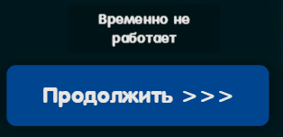

# 💖 Website for Love

**Website for Love** — это сайт, который я создал в подарок своей девушке.  

---

## ✨ Возможности

- Эстетичный дизайн
- Чистый HTML + CSS
- Анимации, оформленные с теплотой
- Пасхалки: юмористические подсказки при наведении, выскакивающие коты и другое

### 🎞️ Примеры пасхалок:


---

## 🛠️ Технологии

- 💻 HTML5
- 🎨 CSS3

---

## 🚀 Как запустить

Чтобы посмотреть сайт вживую, перейдите по ссылке:  
🔗 **[https://dmitrykaras.github.io/](https://dmitrykaras.github.io/)**

---

## 🧪 Запуск локально

1. Склонируйте репозиторий:
   ```bash
   git clone https://github.com/dmitrykaras/website-for-love.git


---

## 📌 Подписи у изображдений




---

## 🌹 О проекте

Этот сайт — это не просто код, а история.  
История о том, как иногда важнее не слова, а моменты, которые мы создаём вместе.  
Пусть он напомнит о встречах, ожидании у метро и маленьких радостях.

---

> Этот сайт — личный подарок, созданный с теплом, заботой и любовью.  
> Он отражает моменты, которые важны для нас, и оформлен так, чтобы их запомнить навсегда.
