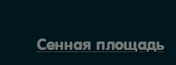

# 💖 Website about Love

**Website for Love** is a website I created as a gift for my girlfriend.  

---

## ✨ Features

- Aesthetic design  
- Clean HTML + CSS  
- Warm, heartfelt animations  
- Easter eggs: humorous hover tips, surprise cats, and more

### 🎞️ Easter Egg Examples:

  
  


---

## 🛠️ Technologies

- 💻 HTML5  
- 🎨 CSS3

---

## 🚀 How to View

To see the live website, follow this link:  
🔗 **[https://dmitrykaras.github.io/](https://dmitrykaras.github.io/)**

---

## 🧪 Run Locally

1. Clone the repository:
   ```bash
   git clone https://github.com/dmitrykaras/website-for-love.git

---

## 📌 Image Captions




---

## 🌹  About the Project

This website is more than just code — it’s a story.
A story about how sometimes, moments we create together matter more than words.
Let it be a reminder of the meetings, the waiting at the metro, and the little joys.

---

> This website is a personal gift, created with warmth, care, and love.
> It reflects the moments that matter to us, designed to be remembered forever.
